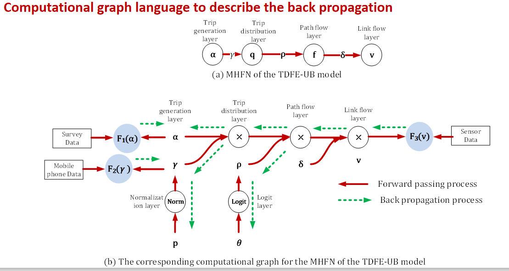
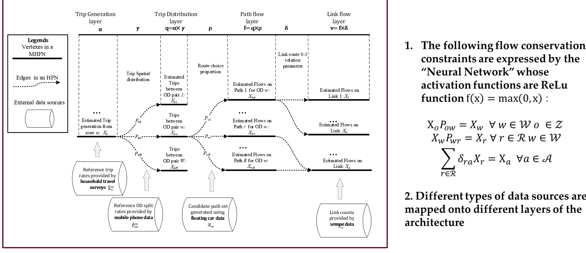
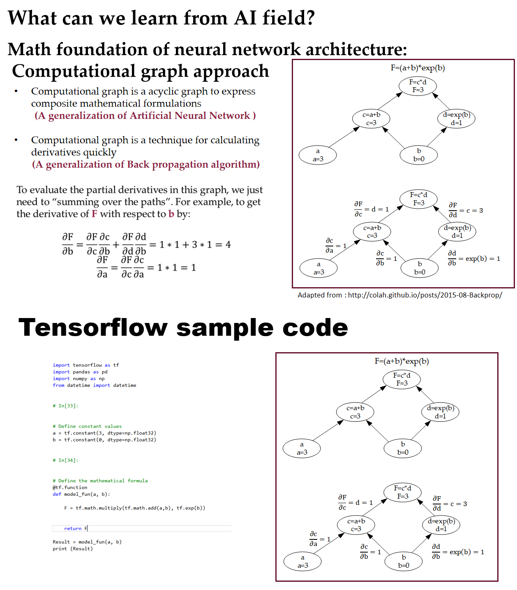

This open-source python package Data2DemandModel aims to demonstrate how to
integrate deep learning methods with the standard 4-step process in
transportation modeling, using a Computational Graph-based approach with
multiple data sources.

This source code is forked from the original contribution by Dr. Xin (Bruce) Wu
at Arizona State University (<https://github.com/Grieverwzn>).

\#Key highlights:

\#How to calibrate OD demand with multiple data sources from loop detectors,
mobile phone data and trip generation samples

\#How to understand layer networks used in Deep Learning from transportation
modeling perspective?

\#How to understand standard computational graph and back propagation methods?

\#Steps for integrating ML/CG in transportation 4-step model calibration

\#Simultaneous Forecasting Model Using an Econometric model +Deep Neural Network

**Starting with Data2DemandModel** If you have not used this package before,
here are some advice to get started.

1.  Read the TomNet presentation or watch the youtube video at .

    https://github.com/asu-trans-ai-lab/Data2DemandModel/blob/master/doc/3_TOMNET_Zhou_How%20to%20integrate%20Deep%20Learning%20Methods%20with%20Transportation%20Model%20Calibration_V5.pdf

2.  Look at the examples at Google colab environment
    <https://github.com/asu-trans-ai-lab/Data2DemandModel/blob/master/Data2DemandModel.ipynb>

3.  Install Python, Data2DemandModel package and QGIS on your computer or using
    google colab environment

4.  Modify one of the examples to implement your own model.

5.  Post your questions on the users group:
    groups.google.com/d/forum/data2DemandModel

\#Published journal paper:
https://github.com/asu-trans-ai-lab/Data2DemandModel/blob/master/doc/5_paper_preprint_v1.pdf

Hierarchical travel demand estimation using multiple data sources: A forward and
backward propagation algorithmic framework on a layered computational graph. TR
Part C.

\#What is GMNS? General Travel Network Format Specification is a product of
Zephyr Foundation, which aims to advance the field through flexible and
efficient support, education, guidance, encouragement, and incubation. Further
Details in https://zephyrtransport.org/projects/2-network-standard-and-tools/
The underlying network uses GMNS format.

To understand back propogation: http://colah.github.io/posts/2015-08-Backprop/

