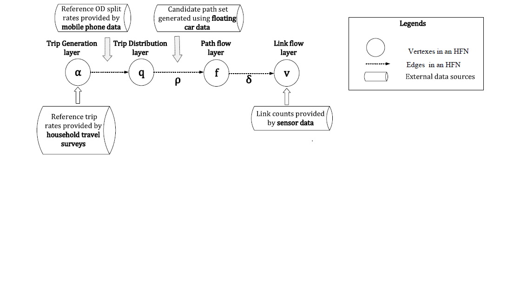
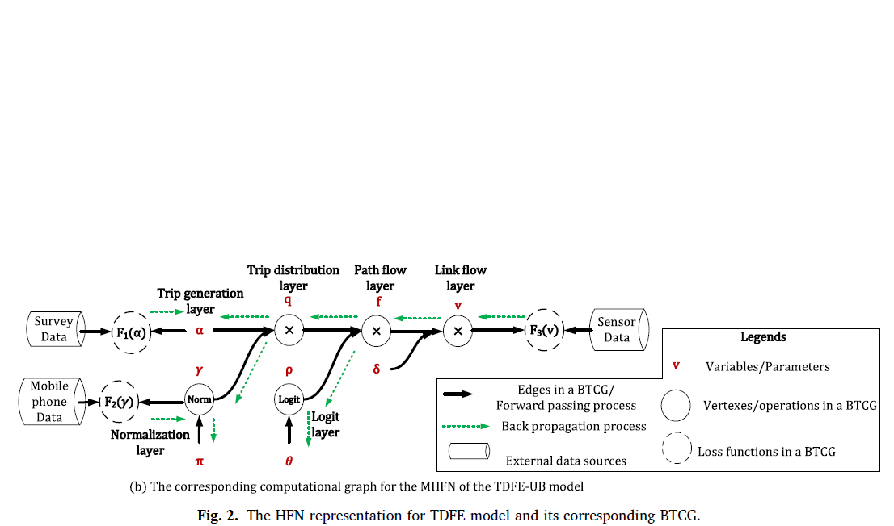
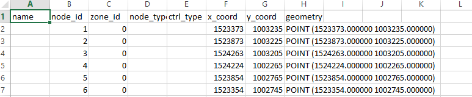
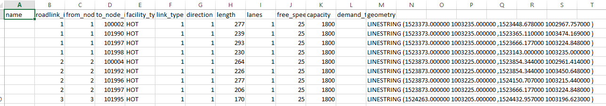
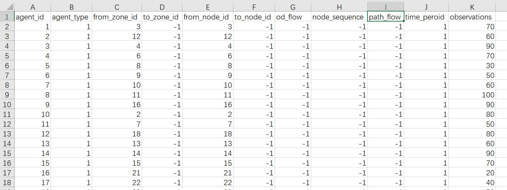
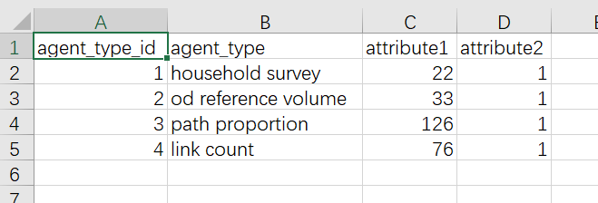
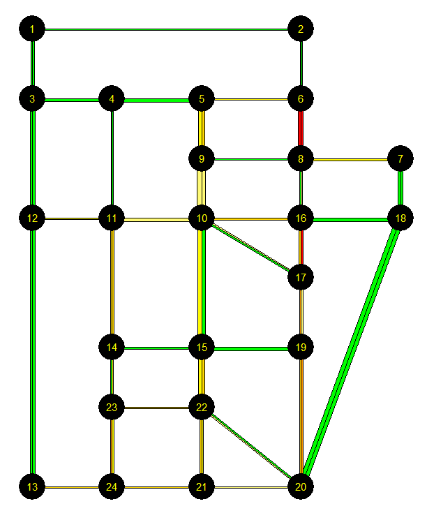
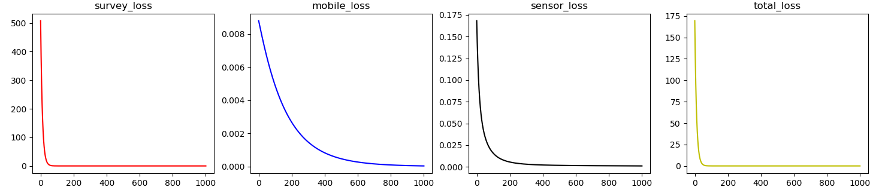
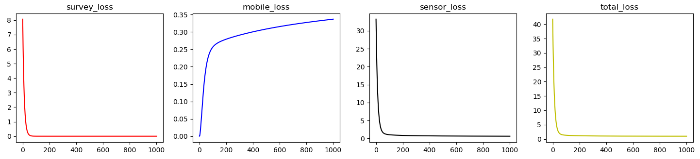

User Guide for ODME for GMNS

Version 0.5, 11/01/2020

Prepared by Dr. Xuesong (Simon) Zhou’ research group at Arizona State University

Contact: xzhou74\@asu.edu

This is a simple user guide for the GMNS data format version of Big data-driven
transportation computational graph framework (TCG).

Software release download (300MB):

<https://www.dropbox.com/s/06gs1vwdp4y953r/TCGLite_GMNS.exe?dl=0>

1.  General introduction

This code is the GMNS data format version of BTCG (Wu et al., 2018). BTCG is a
forward and backward propagation algorithmic framework on a layered
computational graph which can achieve hierarchical travel demand estimation
using multiple data source.

The specific relationship between the layers of HFN is shown in the figure: HFN
of Tatraffic Demand Flow Estimation (TDFE) model. The figure shows the
input/output variables of each layer and the correlation calculation between
layers.

Fig. 1. HFN of TDFE model

BTCG is the implemention of Hierarchical Flow Network (HFN), applying the back
propagation (BP) algorithm, seeing each variable as a vertex and the edge
between vertexes as calculation process between variables. To minimize the loss
function, parameters like α, π and θ are updated during the training process.
Finally, the traffic flow of each layer (e.g. α of ozone layer, γ of od layer, v
of link layer) are estimated.

Fig. 2. Corresponding BTCG of HFN

1.  Program illustration

| Input files                    | Output files                                                   |
|--------------------------------|----------------------------------------------------------------|
| node.csv                       | output_ozone.csv output_od.csv output_path.csv output_link.csv |
| input_agent.csv agent_type.csv |                                                                |
| road_link.csv                  |                                                                |

node.csv

This node.csv may include the basic node information about the test network,
such as name, node_id, zone_id, node_type, ctrl_type, x_coord, y_coord,
geometry, etc.

road_link.csv

Road_link.csv may only include basic network information.

input_agent.csv

All the measurements are stored in input_agent.csv. Our code need the household
survey data (ozone data), the OD reference volume or the OD split rate (mobile
phone data), the link count (sensor data), and the path information such as its
node sequence.

agent_type.csv

agent_type.csv is used to explain the agent type in input_agent.csv. Currently,
it includes agent types :1. household survey 2. od reference volume 3. path
proportion 4. link count, the attribute 1 means the number of observations, and
attribute 2 means the number of time period. In our code, we actually estimate
one day’s traffic volume, so the number of time period is 1.

1.  Case implemention

SiouxFalls network is used as the test case, it has 22 ozones, 24 nodes, 33 ods,
76 links and 132 paths, the network structure is shown in Fig. 3. The GMNS
format data is given in /SiouxFalls network.

Fig. 3. SiouxFalls Network

Training results (1000 epoches)：

BTCGLite_GMNS.py (this code don’t use logit model and class object, so it runs
fater ):

step 1000 :survey error= 6.983434152935154e-08

step 1000 :mobile error= 3.8845606447143905e-05

step 1000 :sensor error= 0.0010404423796513053

step 1000 :total error= 0.0010792072388590332

BTCG_GMNS.py (this code use logit model, through the mobile loss increases,the
total loss decreces, so the BTCG works well)

step 1000 :survey error= 3.1824046e-09

step 1000 :mobile error= 0.3365797

step 1000 :sensor error= 0.6412415

step 1000 :total error= 0.9778478

Ref:

Wu, X., Guo, J., Xian, K., Zhou, X., 2018. Hierarchical travel demand estimation
using multiple data sources: A forward and backward propagation algorithmic
framework on a layered computational graph. Transportation Research Part C:
Emerging Technologies 96, 321-346.
